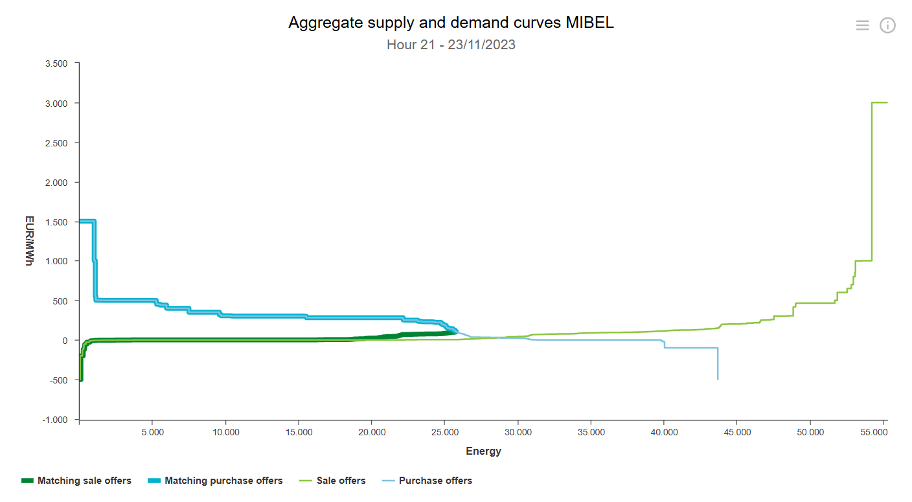
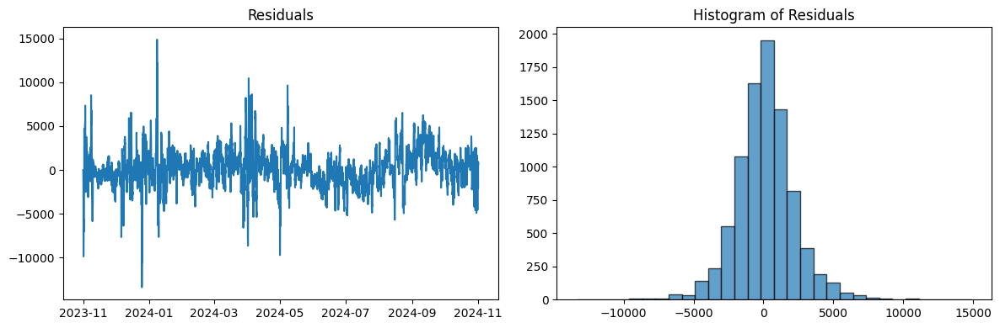
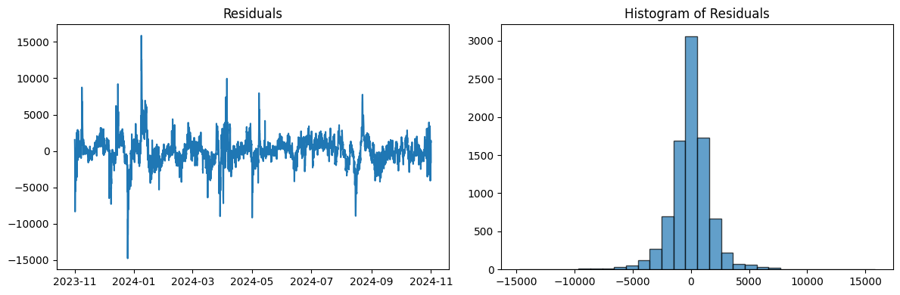
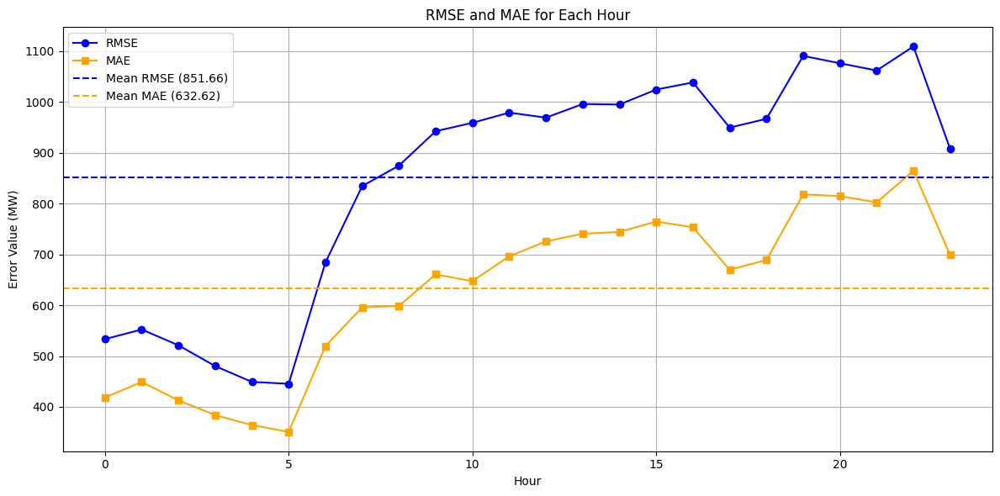
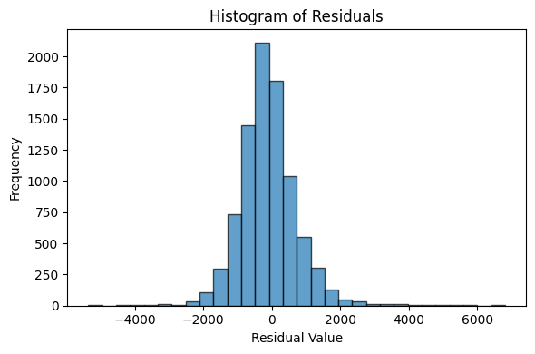
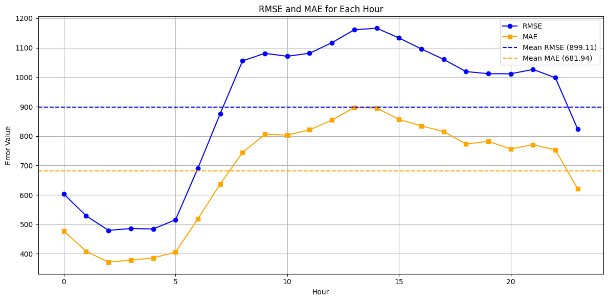
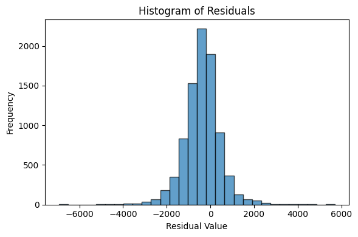

# Spanish Energy Demand and Price Forecasting with ML

## Background

### Spain's Day-Ahead Energy Market

In Spain, the Day-Ahead Market (DAM) sets electricity prices for the following day, with results published at 12:00 PM CET the day before the scheduled delivery. The process begins when market participants (electricity producers, consumers, and traders) submit their hourly price and quantity bids for each hour of the next day, from 00:00 to 23:00. These bids represent the minimum price at which producers are willing to sell and the maximum price at which consumers are willing to buy.

The seller bids are ranked from lowest to highest to form a "bid stack", and contrarily consumers' bids are ranked from highest to lowest. The market operator (OMIE in Spain's case) matches the bids, starting from the lowest seller bid and highest consumer bid, until the buying and selling prices meet. Any consumer bids below this price or seller bids above this price are forgetten about. This sets the marginal price, the highest price needed to meet the demand for each hour. This marginal price is applied uniformly across all producers and consumers for that hour. Renewable energy sources like wind and solar often have lower bids due to their low production costs, while gas and coal plants typically set the marginal price when renewable generation is insufficient.

An example of a bid stack is shown in the figure above. Historical bid stacks for every hour are available [here](https://www.omie.es/en/file-access-list). These could be extremely interesting to analyse for a future project, such as creating a Reinforcement Learning agent for bidding strategically to maximise generator profits or minimise the consumer clearing price for affordable energy.

Price transparency is ensured, and the final Day-Ahead Price is published on OMIE’s website. The market also includes an Intraday Market, where participants can adjust their positions after the Day-Ahead results. If consumers fail to secure sufficient energy in the DAM or if their energy needs change, they can use the intraday market to purchase additional electricity. Similarly, producers can sell any surplus they may have or adjust their commitments to match their real-time production capabilities. Prices are influenced by supply, demand, and the availability of generation sources, ensuring efficient electricity trading.

### Motivation For Accurately Predicting Energy Demand & Price

- **Improved Grid Stability & Reliability** 
    - Accurate demand forecasts help grid operators balance supply and demand, reducing blackouts and inefficiencies.
- **Optimised Energy Trading & Market Operations**
    - Traders can make better decisions on when to buy or sell electricity, maximizing profitability and minimizing risk.
- **Lower Costs & Improved Efficiency**
    - Utilities can optimise power generation schedules, reducing reliance on expensive backup generation and minimizing fuel costs.
- **Integration of Renewable Energy**
    - Helps manage the variability of wind and solar power by anticipating fluctuations and ensuring a stable energy mix.
- **Demand Response & Load Management**
    - Enables demand-side response programs where consumers shift usage to off-peak hours, reducing strain on the grid.
- **Better Policy & Investment Decisions**
    - Governments and investors can use accurate forecasts to plan infrastructure development, incentivise renewables, and improve energy security.

## Energy Demand Prediction

### Requirements

- Predict the energy demand for each hour in the following day (00:00 - 23:00) at 12:00 on the previous day, so as to be useful for the Day Ahead Market.
- Energy cost is not used as a feature because the predicted energy demand will later be used to help forecast energy cost. Including energy cost as an input could create a circular dependency, where the model relies on a variable that is itself influenced by the prediction target.

### Benchmark - Seasonal ARIMA Model

The aim of the SARIMA model is to use linear time series analysis to create an energy demand prediction from which to benchmark the performance of the more complex ML models.

The complete work can be found in : [SARIMA Jupyter Notebook](SARIMA_demand.ipynb)

#### Summary

- A SARIMA model extends ARIMA to include seasonality, which can be effective for regular, repeating patterns like weekly energy demand. Simplicity is prioritised, excluding external predictors like weather or holidays.
- **SARIMA Parameters** : (p, d, q) × (P, D, Q, s).
    - Non-Seasonal: 
        - p: Auto-Regressive order
        - d: Differencing order for stationarity
        - q: Moving Average order
    - Seasonal: 
        - P: Seasonal Auto-Regressive order
        - D: Seasonal Differencing order
        - Q: Seasonal Moving Average order
        - s: Seasonal period (168 for weekly seasonality in this model)
- **Stationarity Testing**
    - Stationarity required for SARIMA to function correctly.
    - Applied Augmented Dickey-Fuller (ADF) test and got that trend differencing (d = 1) and seasonal differencing (D = 1) needed to achieve stationarity.
- **Parameter Estimation**
    - ACF (Autocorrelation Function) and PACF (Partial ACF) plots used to estimate initial parameters: p = 3, q = 50, P = 1, Q = 6.
    - Refined parameters by minimizing Akaike Information Criterion (AIC):
        - Final parameters: (p, d, q, P, D, Q, s) = (2, 1, 3, 1, 1, 1, 168).
- **Model Training**
    - Used a rolling forecast for training using the 500 preceding data points with forecasts made for the following 36 hours for day-ahead energy market. A new SARIMA model was fit every 30 days in the test range.
- **Model Evaluation**
    - Residuals largely follow a normal distribution with slightly fat tails due to extreme values/outliers (e.g., public holidays) not being fully captured.
    - RMSE = 2161.14 MW, MAE = 1575.88 MW and MAPE = 6.06%.
    
- **Week Ahead Forecast**
    - Benchmark using the energy demand for the previous week as the prediction.
    - RMSE = 1822.59 MW, MAE = 1207.44 MW and MAPE = 4.53%.
    
    
    - Outperformed the SARIMA model due to strong weekly periodicity in energy demand.

### XGBoost Model

The aim of the XGBoost model is to leverage advanced machine learning techniques to accurately predict energy demand, capturing complex nonlinear relationships and temporal patterns that traditional time series models may miss.

The complete work can be found in : [XGBoost Jupyter Notebook](xgboost_demand.ipynb)

#### Summary

- A multi-output XGBoost model is needed to predict 24 hourly energy demand values for the following day using a separate model for each hour. This avoids error compounding in autoregressive approaches while capturing hour-specific patterns for improved accuracy.
- **Data Exploration & Preprocessing**
    - Data includes historical energy demand, weather data (e.g. temperature, humidity, wind speed) from multiple Spanish cities and dates of public holidays.
    - Data cleaning, handling missing values, and ensuring correct timestamp alignment.
    - Restructuring data so that all features required for a single prediction (including lagged values and exogenous variables) are contained in a single row of the feature matrix.
- **Feature Engineering**
    - Weighted weather features based on population proximity to the Spanish cities.
    - Lagged features to incorporate temporal dependencies.
    - Cyclical encoding of time features (e.g. day of the week, month) to model seasonality.
    - Categorical features (e.g. holidays, weekends) to model outliers.
- **Feature Selection**
    - Pearson Correlation Matrix to remove highly correlated features.
    - Principal Component Analysis (PCA) applied to reduce dimensionality and improve efficiency.
- **Model Evaluation**
    - RMSE = 851.66 MW, MAE = 632.62 MW and MAPE = 2.39%.
    
    
    
    - This represents a substantial 47 - 53% improvement in both absolute and relative error compared to week ahead benchmark, demonstrating the model's ability to capture complex patterns in the data.
    - The model is saved under `./models/demand_xgboost_model.pkl`

### Transformer Model

The aim of the Transformer model is to leverage self-attention mechanisms to capture both short- and long-range dependencies in energy demand data, allowing for more flexible feature interactions compared to traditional time series models.

The complete work can be found in : [Transformer Jupyter Notebook](transformer_demand.ipynb)

#### Summary

- The model uses an encoder-only Transformer to efficiently predict all 24 hourly demand values in a single forward pass, avoiding the computational cost and error accumulation of autoregressive Seq2Seq models.
- **Data Preprocessing**
    - Reused the pre-cleaned dataset from the XGBoost model.
    - Restructured the dataset into a (24, num_features) matrix per prediction to preserve temporal relationships, unlike XGBoost, which treated each time step as an independent row with lag-based features.
    - The transformer model requires more data for training to learn more complex temporal patterns and relationships. Therefore, model is trained on data for making predictions at every hour rather than just at noon, enabling it to improve generalisation.
- **Model Architecture**
    - The model uses a learnable positional encoding, a linear layer for feature projection, a transformer encoder for learning complex dependencies, and an output layer to predict energy demand at each time step.
    - The selected hyperparameters, including a smaller model dimension, high dropout, low learning rate, and optimized betas to ensure stable training and good generalisation despite limited data.
- **Model Evaluation**
    - RMSE = 899.11 MW, MAE = 681.94 MW and MAPE = 2.57%.
    
    
    
    - This is significantly better that the benchmark model, however it was still outperformed by the XGBoost model which had a MAPE that was 0.18% smaller.
    - The XGBoost model outperformed the Transformer model primarily due to the limited dataset size. Transformers have higher model complexity, making them more prone to overfitting on small datasets.
    - The model is saved under `./models/demand_transformer_model_state.pth`

### Energy Demand Conclusion
In conclusion, the XGBoost model greatly outperformed both the SARIMA model and the benchmark, achieving significantly lower error metrics, with an accuracy of 97.61%. It also slightly surpassed the Transformer model, depsite the Transformer’s ability to capture complex dependencies through self-attention, potentially limited by the smaller dataset. Given XGBoost’s superior performance, it will be used to provide energy demand predictions, which will then be utilised for forecasting energy prices in the following section.

## Data Collection

- Hourly Weather Data for Madrid, Barcelona, Seville, Bilboa, Valencia 2019-2024 - [link](https://www.visualcrossing.com/weather/weather-data-services)
- Hourly energy consumption and generation 2019-2024 - [link](https://newtransparency.entsoe.eu/) or [link](https://transparency.entsoe.eu/)
- Daily Spanish Gas Prices (GDAES_D+1) 2019-2024 - [link](https://www.mibgas.es/en/file-access)
- Spanish population density data - [link](https://data.humdata.org/dataset/worldpop-population-density-for-spain)

- Map of power plants around the world (used to get location of wind and solar plants in spain) - [link](https://datasets.wri.org/datasets/global-power-plant-database?map=eyJ2aWV3U3RhdGUiOnsibG9uZ2l0dWRlIjowLCJsYXRpdHVkZSI6MCwiem9vbSI6MywicGl0Y2giOjAsImJlYXJpbmciOjAsInBhZGRpbmciOnsidG9wIjowLCJib3R0b20iOjAsImxlZnQiOjAsInJpZ2h0IjowfX0sImJhc2VtYXAiOiJsaWdodCIsImJvdW5kYXJpZXMiOmZhbHNlLCJsYWJlbHMiOiJkYXJrIiwiYWN0aXZlTGF5ZXJHcm91cHMiOlt7ImRhdGFzZXRJZCI6IjUzNjIzZGZkLTNkZjYtNGYxNS1hMDkxLTY3NDU3Y2RiNTcxZiIsImxheWVycyI6WyIyYTY5NDI4OS1mZWM5LTRiZmUtYTZkMi01NmMzODY0ZWMzNDkiXX1dLCJib3VuZHMiOnsiYmJveCI6bnVsbCwib3B0aW9ucyI6e319LCJsYXllcnNQYXJzZWQiOltbIjJhNjk0Mjg5LWZlYzktNGJmZS1hNmQyLTU2YzM4NjRlYzM0OSIseyJ2aXNpYmlsaXR5Ijp0cnVlLCJhY3RpdmUiOnRydWUsIm9wYWNpdHkiOjEsInpJbmRleCI6MTF9XV19)
