# Spanish Energy Demand and Price Forecasting with ML

Predicted Spanish day-ahead energy demand and price with 97.5% accuracy using a range of ML and statistical time series forecasting models including `XGBoost`, `Transformers`, `TFTs` and `SARIMA`. 

This invloved optimising model performance via feature engineering and selection, hyper-parameter tuning and model evaluation. Also, curated a 6 million point dataset from government APIs, including historical weather data and energy generation data.

## Contents  

1. [Background](#background)  
2. [Energy Demand Prediction](#energy-demand-prediction)  
   - [Seasonal ARIMA Model](#benchmark---seasonal-arima-model)  
   - [XGBoost Model](#xgboost-model)  
   - [Transformer Model](#transformer-model)
   - [Conclusion](#energy-demand-conclusion)
2. [Energy Price Prediction](#energy-price-prediction)  
   - [Seasonal ARIMA Model](#benchmark---seasonal-arima-model-1)  
   - [XGBoost Model](#xgboost-model-1)  
   - [TFT Model](#tft-model)  
   - [Conclusion](#energy-price-conclusion)
4. [Data Collection](#data-collection)  

## Background

### Spain's Day-Ahead Energy Market

In Spain, the Day-Ahead Market (DAM) sets electricity prices for the following day, with results published at 12:00 PM CET the day before the scheduled delivery. The process begins when market participants (electricity producers, consumers, and traders) submit their hourly price and quantity bids for each hour of the next day, from 00:00 to 23:00. These bids represent the minimum price at which producers are willing to sell and the maximum price at which consumers are willing to buy.

The seller bids are ranked from lowest to highest to form a "bid stack", and contrarily consumers' bids are ranked from highest to lowest. The market operator (OMIE in Spain's case) matches the bids, starting from the lowest seller bid and highest consumer bid, until the buying and selling prices meet. Any consumer bids below this price or seller bids above this price are forgetten about. This sets the marginal price, the highest price needed to meet the demand for each hour. This marginal price is applied uniformly across all producers and consumers for that hour. Renewable energy sources like wind and solar often have lower bids due to their low production costs, while gas and coal plants typically set the marginal price when renewable generation is insufficient.

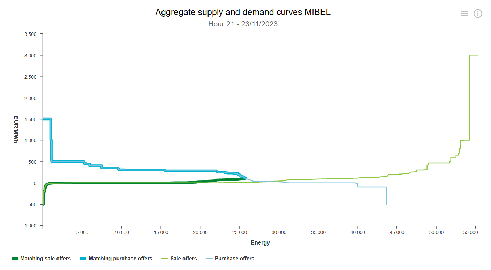

An example of a bid stack is shown in the figure above. Historical bid stacks for every hour are available [here](https://www.omie.es/en/file-access-list). These could be extremely interesting to analyse for a future project, such as creating a Reinforcement Learning agent for bidding strategically to maximise generator profits or minimise the consumer clearing price for affordable energy.

Price transparency is ensured, and the final Day-Ahead Price is published on OMIE’s website. The market also includes an Intraday Market, where participants can adjust their positions after the Day-Ahead results. If consumers fail to secure sufficient energy in the DAM or if their energy needs change, they can use the intraday market to purchase additional electricity. Similarly, producers can sell any surplus they may have or adjust their commitments to match their real-time production capabilities. Prices are influenced by supply, demand, and the availability of generation sources, ensuring efficient electricity trading.

### Motivation For Accurately Predicting Energy Demand & Price

- **Improved Grid Stability & Reliability**  - Accurate demand forecasts help grid operators balance supply and demand, reducing blackouts and inefficiencies.
- **Optimised Energy Trading & Market Operations** - Traders can make better decisions on when to buy or sell electricity, maximizing profitability and minimizing risk.
- **Lower Costs & Improved Efficiency** - Utilities can optimise power generation schedules, reducing reliance on expensive backup generation and minimizing fuel costs.
- **Integration of Renewable Energy** - Helps manage the variability of wind and solar power by anticipating fluctuations and ensuring a stable energy mix.
- **Demand Response & Load Management** - Enables demand-side response programs where consumers shift usage to off-peak hours, reducing strain on the grid.
- **Better Policy & Investment Decisions** - Governments and investors can use accurate forecasts to plan infrastructure development, incentivise renewables, and improve energy security.

## Energy Demand Prediction

### Requirements

- Predict the energy demand for each hour in the following day (00:00 - 23:00) at 12:00 on the previous day, so as to be useful for the Day Ahead Market.
- Energy cost is not used as a feature because the predicted energy demand will later be used to help forecast energy cost. Including energy cost as an input could create a circular dependency, where the model relies on a variable that is itself influenced by the prediction target.

### Benchmark - Seasonal ARIMA Model

The aim of the SARIMA model is to use linear time series analysis to create an energy demand prediction from which to benchmark the performance of the more complex ML models.

The complete work can be found in : [SARIMA Jupyter Notebook](SARIMA_demand.ipynb)

#### Summary

- A SARIMA model extends ARIMA to include seasonality, which can be effective for regular, repeating patterns like weekly energy demand. Simplicity is prioritised, excluding external predictors like weather or holidays.
- `Augmented Dickey-Fuller (ADF) Test`, `ACF (Autocorrelation Function)`, `PACF (Partial ACF)`, `Akaike Information Criterion (AIC)`, `Rolling Forecast`
- **Model Evaluation**
    - RMSE = 2161.14 MW, MAE = 1575.88 MW and MAPE = 6.06%.
    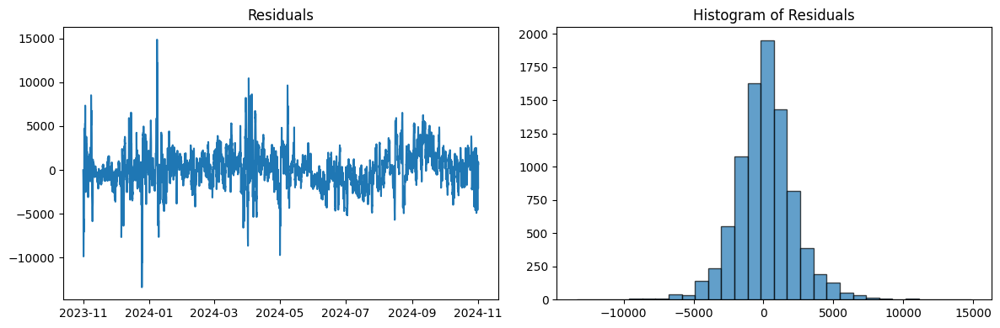
- **Week Ahead Forecast**
    - Benchmark using the energy demand for the previous week as the prediction.
    - RMSE = 1822.59 MW, MAE = 1207.44 MW and MAPE = 4.53%.
    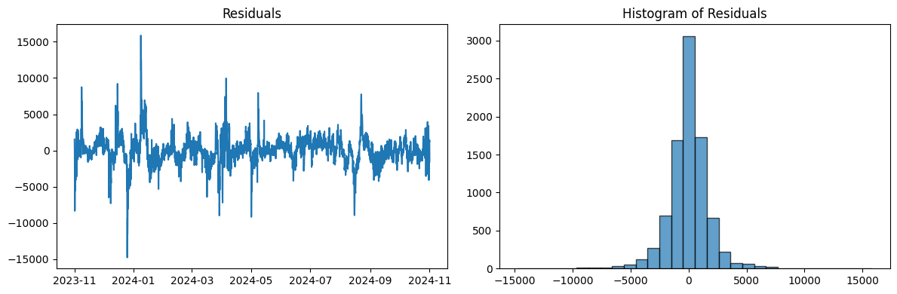
    
    - Outperformed the SARIMA model due to strong weekly periodicity in energy demand.

### XGBoost Model

The aim of the XGBoost model is to leverage advanced machine learning techniques to accurately predict energy demand, capturing complex nonlinear relationships and temporal patterns that traditional time series models may miss.

The complete work can be found in : [XGBoost Jupyter Notebook](xgboost_demand.ipynb)

#### Summary

- XGBoost was selected for energy demand forecasting due to its ability to handle non-linearity, capture feature interactions, and manage missing or noisy data while avoiding overfitting through regularisation, making it more suitable than other non-neural-network-based machine learning methods.
- `Multi-Output XGBoost`, `Data Exploration & Preprocessing`, `Lagged Features`, `Cyclical Feature Encoding`, `Categorical Features`, `Voronoi Diagram`, `Pearson Correlation Matrix`, `Principal Component Analysis (PCA)`, `Hyperparameter Tuning`
- **Model Evaluation**
    - RMSE = 851.66 MW, MAE = 632.62 MW and MAPE = 2.39%.
    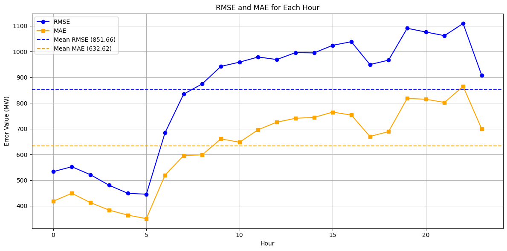
    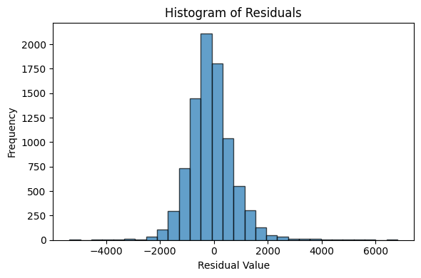
    
    - This represents a substantial 47 - 53% improvement in both absolute and relative error compared to week ahead benchmark, demonstrating the model's ability to capture complex patterns in the data.
    - The model is saved under `./models/demand_xgboost_model.pkl`

### Transformer Model

The aim of the Transformer model is to leverage self-attention mechanisms to capture both short- and long-range dependencies in energy demand data, allowing for more flexible feature interactions compared to traditional time series models.

The complete work can be found in : [Transformer Jupyter Notebook](transformer_demand.ipynb)

#### Summary

- The Transformer was selected for energy demand forecasting because its self-attention mechanism efficiently captures both short- and long-term dependencies, handles multiple input features simultaneously, and scales well for multi-output tasks, making it more suitable than other neural network-based methods.
- `Encoder-only Transformer`, `Seq2Seq`, `Data Restructuring`, `Model Architecture`, `Learnable Positional Encoding`, `Hyperparameter Tuning`
- **Model Evaluation**
    - RMSE = 899.11 MW, MAE = 681.94 MW and MAPE = 2.57%.
    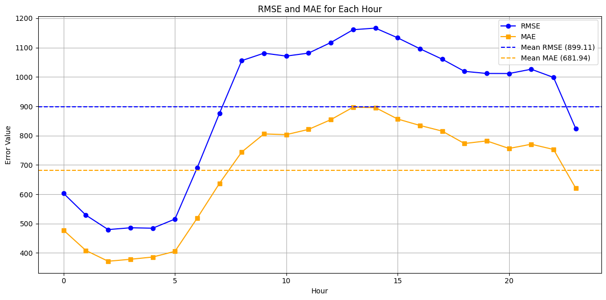
    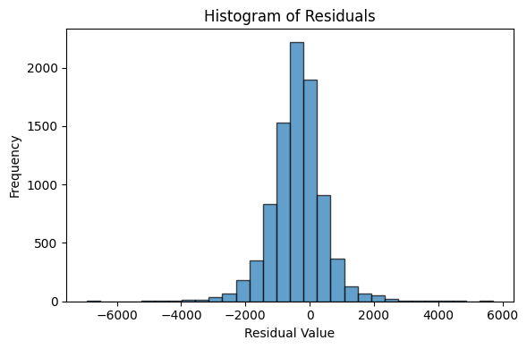
    
    - This is significantly better that the benchmark model, however it was still outperformed by the XGBoost model which had a MAPE that was 0.18% smaller.
    - The XGBoost model outperformed the Transformer model primarily due to the limited dataset size. Transformers have higher model complexity, making them more prone to overfitting on small datasets and failing to generalise well.
    - The model is saved under `./models/demand_transformer_model_state.pth`

### Energy Demand Conclusion
In conclusion, the XGBoost model greatly outperformed both the SARIMA model and the benchmark, achieving significantly lower error metrics, with an accuracy of 97.61%. It also slightly surpassed the Transformer model, depsite the Transformer’s ability to capture complex dependencies through self-attention, potentially limited by the smaller dataset. Given XGBoost’s superior performance, it will be used to provide energy demand predictions, which will then be utilised for forecasting energy prices in the following section.

## Energy Price Prediction

### Requirements

- Predict the energy price for each hour in the following day (00:00 - 23:00) at 12:00 on the previous day, so as to be useful for the Day Ahead Market.

### Benchmark - Seasonal ARIMA Model

The aim of the SARIMA model is to use linear time series analysis to create an energy price prediction from which to benchmark the performance of the more complex ML models.

The complete work can be found in : [SARIMA Jupyter Notebook](SARIMA_price.ipynb)

#### Summary

- A SARIMA model extends ARIMA to include seasonality, which can be effective for regular, repeating patterns like weekly energy price. Simplicity is prioritised, excluding external predictors like weather or holidays.
- `Augmented Dickey-Fuller (ADF) Test`, `Akaike Information Criterion (AIC)`, `Rolling Forecast`
- **Model Evaluation**
    - RMSE = 34.97 EUR/MWh, MAE = 26.08 EUR/MWh
    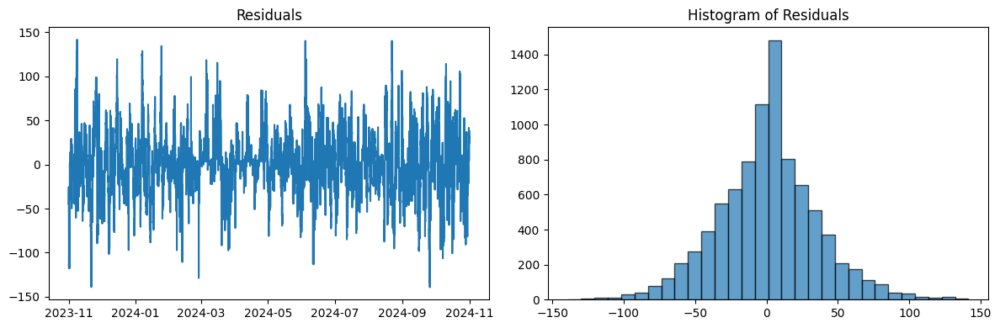
- **Day / Week Ahead Forecast**
    - Benchmark using the energy price for the previous day / week as the prediction.
    - Week Ahead: RMSE = 35.89 EUR/MWh, MAE = 26.34 EUR/MWh
    - Day Ahead: RMSE = 30.70 EUR/MWh, MAE = 21.16 EUR/MWh
    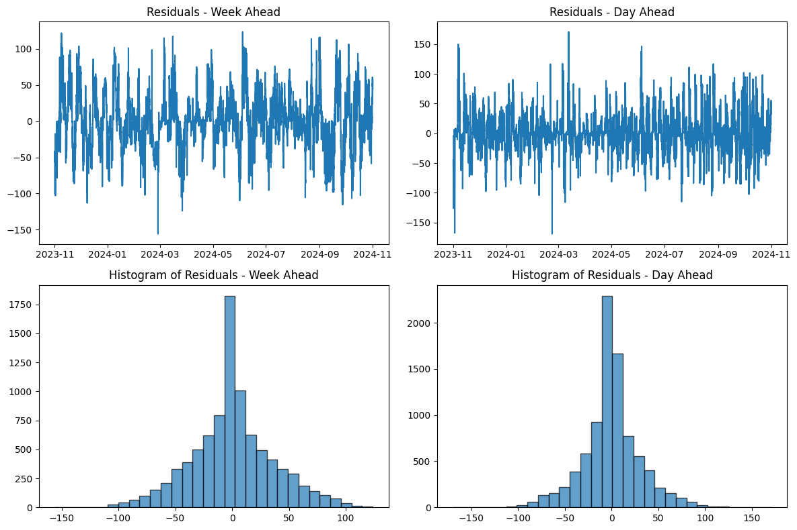
    
    - Day ahead outperformed the SARIMA model due to strong daily periodicity in energy price.

### XGBoost Model

The aim of the XGBoost model is to leverage advanced machine learning techniques to accurately predict energy price, capturing complex nonlinear relationships and temporal patterns that traditional time series models may miss.

The complete work can be found in : [XGBoost Jupyter Notebook](xgboost_price.ipynb)

#### Summary

- XGBoost was selected for energy price forecasting due to its ability to handle non-linearity, capture feature interactions, and manage missing or noisy data while avoiding overfitting through regularisation, making it more suitable than other non-neural-network-based machine learning methods.
- `Multi-Output XGBoost`, `Data Exploration & Preprocessing`, `Lagged Features`, `Cyclical Feature Encoding`, `Categorical Features`, `Voronoi Diagram`, `Pearson Correlation Matrix`, `Shap`, `Successive Feature Removal`, `Cross-Validation`, `Hyperparameter Tuning`
- **Model Evaluation**
    - RMSE = 21.57 EUR/MWh, MAE = 16.57 EUR/MWh
    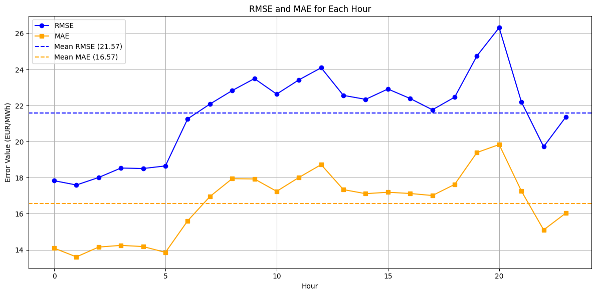
    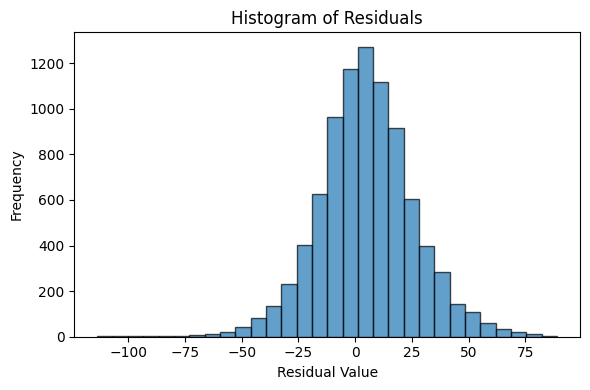
    
    - This represents a substantial 22-29% improvement in error compared to the day ahead benchmark, demonstrating the model's ability to capture complex patterns in the data.
    - The model is saved under `./models/price_xgboost_model.pkl`

### TFT Model

The aim of the TFT model is to ...

The complete work can be found in : [TFT Jupyter Notebook](tft_price.ipynb)

#### Summary

### Energy Price Conclusion

## Data Collection

- Hourly Weather Data for Madrid, Barcelona, Seville, Bilboa, Valencia 2019-2024 - [link](https://www.visualcrossing.com/weather/weather-data-services)
- Hourly energy consumption and generation 2019-2024 - [link](https://newtransparency.entsoe.eu/) or [link](https://transparency.entsoe.eu/)
- Daily Spanish Gas Prices (GDAES_D+1) 2019-2024 - [link](https://www.mibgas.es/en/file-access)
- Spanish population density data - [link](https://data.humdata.org/dataset/worldpop-population-density-for-spain)

- Map of power plants around the world (used to get location of wind, solar and hydro plants in spain) - [link](https://datasets.wri.org/datasets/global-power-plant-database)
